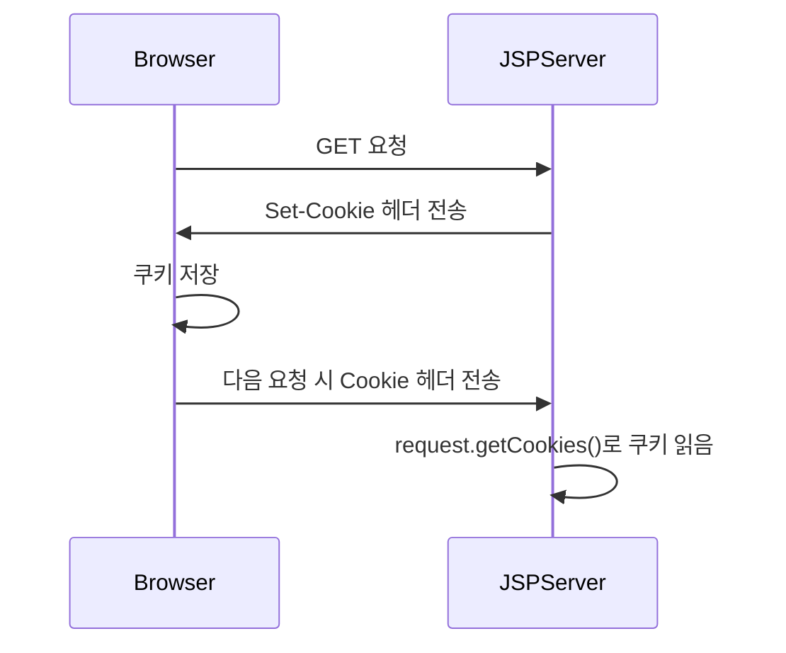
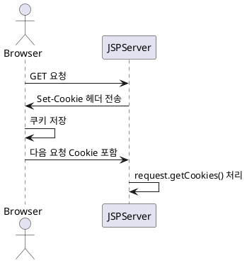

```

<!-- 0. 대응 파일 : 
IdSaveMain : login
IDSaveProcess : loginProcess
java.utils 안에 CookieManager.java, JSFunction.java 2 파일 추가
 -->

<!-- 1. login : 임포트, 쿠키 객체 추가 --> 

<%@page import="utils.CookieManager"%>
<% 
	String loginId = CookieManager.readCookie(request, "loginId");
	String cookieCheck = "";
	if(!loginId.equals("")){
		cookieCheck = "checked";
	}
%>

<!-- 2. login : 체크박스 추가랑, id & 체크박스에 name이 아니고 value로 %코드 추가  -->
						
						
						<li><input type="text" name="id" size="30" placeholder="아이디" value="<%=loginId %>" /></li>
						<li><input type="password" name="pw" size="30" placeholder="비밀번호"/></li>
						
						<li>
							<input type="checkbox" class="css-checkbox" name="save_check" id="chkid"  <%=cookieCheck %>/>
							<label for="chkid">아이디</label>
						</li>						
						
						<!-- 여기까지  -->

<!-- 3. loginProcess : 임포트하고   -->

<%@page import="utils.JSFunction"%>
<%@page import="utils.CookieManager"%>

// 4. loginProcess : 쿠기 관련 내용 추가, 체크박스의 equals의 기본은 "on"이라 그거 수정
		
		if(save_check != null && save_check.equals("on")){
			CookieManager.makeCookie(response, "loginId", id, 86400);
		}else{
			CookieManager.deleteCookie(response, "loginId");
		}
		

```





